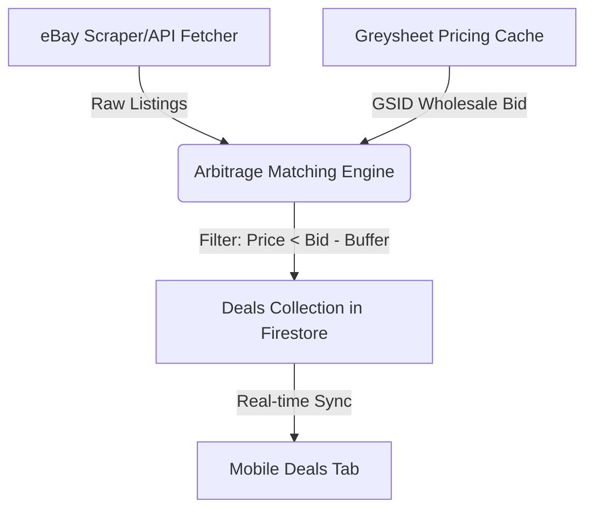

# Design Proposals — Greysheet API Expansion Features

This document outlines the product requirements and technical design for three advanced features built on top of the Greysheet API integration.

---

## Feature 1 — Automated "Underpriced" Deal Finder (Arbitrage Finder)

### 1. Product Requirements
- Automatically cross-reference active eBay listings (or parsed web listings) against the coin's Greysheet Wholesale Bid price.
- If a listing is priced below the Greysheet Wholesale Bid (minus a configurable shipping/fee adjustment), flag it in the UI as a **"Potential Arbitrage Deal"**.
- Provide a dedicated **"Deals Dashboard"** where users can filter by denomination, margin percentage, or total dollar spread, and click direct referral links to buy.

### 2. Technical Architecture


### 3. Data Model
A new Firestore collection `deals` containing:
```json
{
  "id": "ebay_1234567890",
  "title": "1881-S Morgan Silver Dollar NGC MS64 Strong Cartwheel luster",
  "source": "ebay",
  "url": "https://www.ebay.com/itm/1234567890",
  "price": 75.00,
  "shipping": 4.50,
  "gsid": 429,
  "grade": "MS64",
  "greysheet_bid": 95.00,
  "net_margin": 15.50,
  "margin_percent": 16.3,
  "timestamp": "2026-07-08T21:00:00Z"
}
```

---

## Feature 2 — CAC Premium Valuation & Sticker Verification

### 1. Product Requirements
- **CAC Sticker Recognition**: Allow users to toggle green or gold CAC stickers on certified coin pages.
- **Auto-Verification**: Look up certification numbers (PCGS/NGC) to automatically verify their genuine CAC status via API.
- **Accurate Pricing**: The Greysheet API returns specific CAC-stuck columns. If a coin is marked CAC, the portfolio calculator and detail pages must automatically display the higher CAC bid/retail prices.

### 2. Technical Architecture
- **Resolver Expansion**: Update the backend `greysheet_service.py` to search for `IsCac: True` records in the pricing payload.
- **Portfolio Fallback**: Update valuation math in `main.py` and `estate_planning_screen.dart` to check `coin.hasCacSticker` and return the CAC-specific price when available.

---

## Feature 3 — Collection Value Trailing & Market Trend Analytics

### 1. Product Requirements
- **Sparklines & Charts**: Add interactive line charts on the dashboard showing the total value of the collection over the last 30, 90, and 365 days.
- **Gainers & Losers list**: Display the top 3 coins that gained the most value and the top 3 that lost the most value over the current month.
- **PDF Trend Report**: Export a monthly portfolio statement showing the exact appreciation or depreciation of assets.

### 2. Technical Architecture
- **Daily Cron Worker**: Run a scheduled GCP Cloud Function (via Cloud Scheduler) at midnight. The worker iterates through active portfolios, calculates their total value, and writes a history record to a sub-collection: `users/{email}/portfolio_history/{date_yyyy_mm_dd}`.
- **Trend Charts**: Render historical records using the existing `portfolio_charts.dart` line-chart widget.
