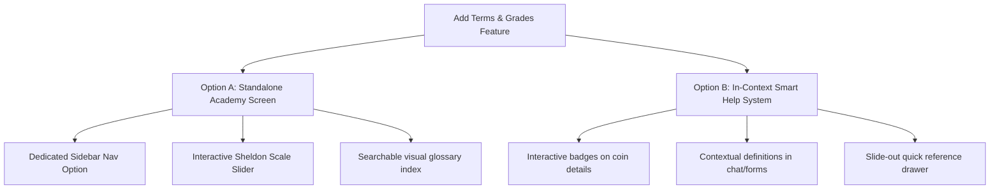

# Coin Terms & Grades Reference Feature

This plan details the addition of a comprehensive "Terms & Grades" reference and learning utility within the Numista.AI application. It includes our research on the Sheldon coin grading scale, standard numismatic terms, custom-generated visual illustrations, and two alternative Conditions of Satisfaction (COS) for implementation.

---

## Coin Grading & Terminology Research

### 1. The Sheldon Coin Grading Scale (1–70)
The international standard for coin grading runs from **1 to 70**, representing a coin's state of preservation. It is divided into clear adjectival bands:

*   **Basal/Poor (P-1 to P-2):** Heavily worn, flat, barely identifiable design elements.
*   **Fair (FR-2 to FR-3):** Rims worn into fields, but major details/date are identifiable.
*   **About Good (AG-3):** Lettering and design merged; date worn but readable.
*   **Good (G-4 to G-6):** Rims are fully intact, main design details visible but flat.
*   **Very Good (VG-8 to VG-10):** Basic features clearly visible; rims defined but flat.
*   **Fine (F-12 to F-15):** Wear on all design areas, but deeply recessed parts are clean and letters are sharp.
*   **Very Fine (VF-20 to VF-35):** Moderate wear; high points worn flat, but over half of the design details remain.
*   **Extremely Fine (XF-40 to XF-45 / EF):** Very light wear on high points; designs are sharp, with some original luster.
*   **About Uncirculated (AU-50 to AU-58):** Slight wear or friction on the absolute highest design points (e.g. hair strands, chest lines). Original luster is mostly intact.
    *   *AU-58 ("Slider"):* Looks like a Mint State coin at first glance, but close inspection reveals trace cabinet friction on high points.
*   **Mint State (MS-60 to MS-70 / Uncirculated):** No wear from circulation. Differing grades are determined by contact marks (nicks/dings), luster quality, and strike strength:
    *   *MS-60 to MS-62:* Dull luster, heavy bag marks/scratches, poor eye appeal.
    *   *MS-63 to MS-64 (Choice):* Average strike, normal amount of bag marks, nice luster.
    *   *MS-65 to MS-66 (Gem):* Exceptional strike, minimal marks, brilliant luster.
    *   *MS-67 to MS-69 (Superb Gem):* Virtually flawless, marks barely visible under magnification.
    *   *MS-70 (Perfect):* Flawless under 5x magnification; exceptional luster and strike.
*   **Proof (PR/PF-60 to PR/PF-70):** Not a grade, but a *strike type* made on specially polished dies and planchets for collectors, exhibiting reflective fields and frosted devices.

### 2. Standard Numismatic Terms
*   **Luster:** The reflective finish or "frost" caused by flow lines on a coin's surface. Luster disappears with wear or cleaning.
*   **High Points:** The raised features on a coin's design that wear down first (e.g., cheek, hair curls, eagle's wingtips/breast).
*   **Field:** The flat background of a coin containing no designs.
*   **Device:** The raised design elements or portraits on a coin.
*   **Rim:** The raised outer boundary designed to protect the coin's face from wear.
*   **Planchet:** The blank piece of metal before it is stamped by the coin dies.
*   **Strike:** The pressure and crispness with which the die stamps the coin.
*   **Bag Marks (Contact Marks):** Small nicks on a coin caused by hitting other coins in bags at the mint.
*   **Toning:** Natural coloration on a coin's surface due to chemical reactions with the air or packaging over time.
*   **Slab:** The plastic holder used by professional services (like PCGS/NGC) to encapsulate and protect graded coins.
*   **Cull:** A coin that is extremely worn, damaged, or otherwise of very low collectible value.

---

## Custom Visual Illustrations

To enhance visual understanding, we have generated two custom high-fidelity diagrams:

### Coin Anatomy & High Points Diagram
This diagram highlights standard coin features (field, rim, device) and maps the high points where wear first occurs on obverse/reverse surfaces.

### Grade Wear Comparison (AU-58 vs. MS-65)
A side-by-side microscopic comparison guide showing how to spot slight wear on high points (About Uncirculated 58) vs. full uncirculated luster (Mint State 65).

---

## Conditions of Satisfaction (COS) Options

Choose one of the following two implementation routes:

### Option A: Standalone "Numismatic Academy" Screen
A comprehensive, centralized learning hub where users go to study the Sheldon scale and coin vocabulary.

*   **COS-A.1:** A new nav item is added to the desktop sidebar and settings screen: "Grading & Glossary".
*   **COS-A.2:** Contains an **interactive slider (1-70)** that shows the adjectival name, description of wear, luster level, and specific inspection tips for each grade band.
*   **COS-A.3:** Includes a searchable glossary tab with filters (e.g. Surface, Manufacture, General) and definitions.
*   **COS-A.4:** Integrates the custom generated anatomy and comparison illustrations in a visual walkthrough section.
*   **COS-A.5:** Provides a "Compare Grades" tab showing side-by-side differences between close grades (e.g., AU-58 vs MS-60).

### Option B: Context-Aware "Grade Companion" System
Rather than sending users to a separate screen, this integrates knowledge inline where they view and enter coins, keeping the experience seamless.

*   **COS-B.1:** Anywhere a grade (e.g., AU-58, MS-65) is displayed on the **Coin Detail Screen**, **My Collection**, or **Review Hub**, it is styled as a clickable chip.
*   **COS-B.2:** Tapping a grade chip opens an elegant, interactive **Bottom Sheet or Modal** that outlines what that specific grade means on the Sheldon scale, its wear traits, and displays the grade-comparison illustration.
*   **COS-B.3:** Technical terms inside descriptions or AI Chat (e.g., "luster", "bag marks", "strike") are styled with a subtle dotted underline; tapping them opens a lightweight tooltip definition.
*   **COS-B.4:** In the **Add Coins Hub** (under Manual entry or Checklist scan confirming), a small "?" icon is added next to the Grade input field. Clicking it slides out a quick-reference grading sheet.

---

## Open Questions

> [!IMPORTANT]
> **Which option do you prefer?**
> - **Option A** is excellent for structured learning and a dedicated reference page.
> - **Option B** is more integrated, saving users clicks by explaining things inline when they encounter them.
> 
> *Alternatively, we could implement a hybrid approach where Option B's interactive chips link back to the full Academy screen.*
