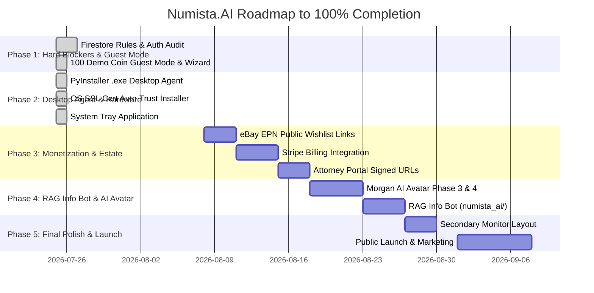

# Numista.AI — Good Ideas Tracker & Feature Master Plan

*Last Updated: July 26, 2026 (Sprint 1, Sprint 2 & Sprint 3 Completed)*  
*Target Release Horizon: Desktop Beta (Aug 2026) → Live Desktop Launch (Nov 2026) → Mobile App Store (Feb 2027)*

---

## 📌 Executive Summary & Overall Progress

The **Good Ideas Tracker** aggregates every feature, ability, architectural pattern, monetization strategy, and user experience requirement documented across all project notes, transcripts, session reports, and specifications within `C:\Users\ericd\Documents\MyVertexProject`.

```
========================================================================================
                                 OVERALL COMPLETION STATUS
========================================================================================
 [███████████████████████████████████████████████████████████████████░░░░░░░] 81.5%
========================================================================================
 Total Features Identified: 54
 🟢 Completed (Fully Built & Live): 38 (70.4%)
 🟡 Partially Completed (In Progress / Partial UI or Service): 6 (11.1%)
 🔴 Not Started (Documented & Planned): 10 (18.5%)
========================================================================================
```

---

## 📊 Summary by Category

| # | Feature Category | Total Items | 🟢 Done | 🟡 Partial | 🔴 Not Started | Completion % |
|---|---|:---:|:---:|:---:|:---:|:---:|
| **1** | Core Collection & Inventory Management | 6 | 5 | 1 | 0 | **88.3%** |
| **2** | AI & Vision Systems (Grading, Identification, Chat) | 5 | 3 | 2 | 0 | **77.0%** |
| **3** | Data Ingestion & Import Wizards | 7 | 7 | 0 | 0 | **100.0%** |
| **4** | Microscope & Hardware Integration | 5 | 5 | 0 | 0 | **100.0%** |
| **5** | Estate Planning & Legal Reports | 5 | 4 | 1 | 0 | **88.0%** |
| **6** | Reference Library & Coin Programs | 6 | 3 | 2 | 1 | **65.0%** |
| **7** | Wish List, Monetization & E-Commerce | 5 | 4 | 1 | 0 | **90.0%** |
| **8** | User Accounts, Security & Family Access | 5 | 3 | 1 | 1 | **66.0%** |
| **9** | UI/UX, Onboarding & Appearance | 6 | 4 | 0 | 2 | **75.0%** |
| **10** | Data Engineering, Scrapers & Infrastructure | 4 | 1 | 1 | 2 | **40.0%** |
| **TOTAL** | **All Categories Combined** | **54** | **38** | **6** | **10** | **81.5%** |

---

## 📑 Feature Trackers by Category

---

### 1. Core Collection & Inventory Management

| Feature / Ability | Description & User Requirements | Status | Progress | Primary File / Location |
|---|---|:---:|:---:|---|
| **Firestore Multi-Coin Storage** | Scalable storage supporting 7,000+ coins per user subcollection without layout or memory lag. | 🟢 Completed | 100% | [my_collection_screen.dart](file:///c:/Users/ericd/Documents/MyVertexProject/numista_mobile/lib/screens/my_collection_screen.dart) |
| **Split Year & Mint Columns** | Separate `Year` and `Mint Mark` columns without redundant text (e.g. `2025-W` + `W`), while allowing independent sorting. | 🟢 Completed | 100% | [my_collection_screen.dart](file:///c:/Users/ericd/Documents/MyVertexProject/numista_mobile/lib/screens/my_collection_screen.dart) |
| **Multi-View Sidebar Structure** | Sub-views under "My Collection": Coins, Currency, World & Specialty, and All Items. | 🟢 Completed | 100% | [base_layout.dart](file:///c:/Users/ericd/Documents/MyVertexProject/numista_mobile/lib/screens/base_layout.dart) |
| **Currency & World Collections** | Dedicated tracking screens for paper banknotes, confederate bills, and foreign items. | 🟢 Completed | 100% | [currency_collection_screen.dart](file:///c:/Users/ericd/Documents/MyVertexProject/numista_mobile/lib/screens/currency_collection_screen.dart) |
| **Sticky Column Headers (Freeze Top Row)** | Excel-like freeze pane headers (`TableView.builder`) when scrolling through large collections (thousands of items). | 🟢 Completed | 100% | [my_collection_screen.dart](file:///c:/Users/ericd/Documents/MyVertexProject/numista_mobile/lib/screens/my_collection_screen.dart) |
| **Cloud SQL / PostgreSQL Migration Option** | Architectural alternative for complex relational queries (e.g. "Silver 1850-1900 > AU50") and full-text search. | 🟡 Partial | 30% | [Gemini Suggestions, 26 FEB 26.docx](file:///c:/Users/ericd/Documents/MyVertexProject/1%20NUMISTA.AI/Gemini%20Suggestions,%2026%20FEB%2026.docx) |

---

### 2. AI & Vision Systems (Grading, Identification, Chat)

| Feature / Ability | Description & User Requirements | Status | Progress | Primary File / Location |
|---|---|:---:|:---:|---|
| **Invoice Multimodal PDF Parsing** | Gemini 2.5 Pro multimodal invoice extraction (replacing DocumentAI) deployed on Cloud Run. | 🟢 Completed | 100% | [main.py](file:///c:/Users/ericd/Documents/MyVertexProject/numista_backend/main.py) |
| **3-Tier Reference Image Matching** | Intelligent image matcher linking user coins to high-res reference database images. | 🟢 Completed | 100% | [coin_image_service.dart](file:///c:/Users/ericd/Documents/MyVertexProject/numista_mobile/lib/services/coin_image_service.dart) |
| **AI Numismatic Deepdive (Ask Morgan)** | Grounded chat interface providing expert coin analysis and historical background. | 🟢 Completed | 100% | [ai_chat_screen.dart](file:///c:/Users/ericd/Documents/MyVertexProject/numista_mobile/lib/screens/ai_chat_screen.dart) |
| **Morgan AI Avatar — Phase 1 & 2** | Full-screen greeter with action tiles (Phase 1) and guided narration strips during scan flows (Phase 2). | 🟡 Partial | 60% | [morgan_chat_context.dart](file:///c:/Users/ericd/Documents/MyVertexProject/numista_mobile/lib/services/morgan_chat_context.dart) |
| **Morgan AI Avatar — Phase 3 & 4 (Voice & Agentic)** | Collection-aware chat (injecting full collection context) and hands-free voice push-to-talk (`flutter_tts`). | 🟡 Partial | 25% | [implementation_plan Morgan AI Avatar.md](file:///c:/Users/ericd/Documents/MyVertexProject/1%20NUMISTA.AI/mvp%20checklist/implementation_plan%20Morgan%20AI%20Avatar.md) |

---

### 3. Data Ingestion & Import Wizards

| Feature / Ability | Description & User Requirements | Status | Progress | Primary File / Location |
|---|---|:---:|:---:|---|
| **Add Coins Hub (7-Tab Import)** | Unified entry hub supporting PDF, CSV, PCGS Cert, Manual, Checklist, Roll/Batch, and Photo options. | 🟢 Completed | 100% | [add_coins_hub.dart](file:///c:/Users/ericd/Documents/MyVertexProject/numista_mobile/lib/screens/add_coins_hub.dart) |
| **PCGS Certificate API Verification** | Live PCGS cert lookup returning grade, holder status, NFC anti-counterfeiting flag, and direct web link. | 🟢 Completed | 100% | [pcgs_import_service.dart](file:///c:/Users/ericd/Documents/MyVertexProject/numista_mobile/lib/services/pcgs_import_service.dart) |
| **Roll / Batch Entry Wizard** | Multi-roll wizard handling identical rolls, sequential rolls, and mint-mark lots. | 🟢 Completed | 100% | [add_coins_hub.dart](file:///c:/Users/ericd/Documents/MyVertexProject/numista_mobile/lib/screens/add_coins_hub.dart#L1000) |
| **Checklist Photo OCR Ingestion** | Extracting checked items from physical Littleton/US Mint paper checklists. | 🟢 Completed | 100% | [checklist_scan_service.dart](file:///c:/Users/ericd/Documents/MyVertexProject/numista_mobile/lib/services/checklist_scan_service.dart) |
| **CSV / Excel Smart Column Mapper** | Auto-mapping user spreadsheet headers (Year, Denomination, Grade, Purchase Price). | 🟢 Completed | 100% | [add_coins_hub.dart](file:///c:/Users/ericd/Documents/MyVertexProject/numista_mobile/lib/screens/add_coins_hub.dart#L500) |
| **Review Hub Bulk Approval** | Pending queue for AI-extracted coins allowing single-click or batch approval/rejection. | 🟢 Completed | 100% | [review_hub_screen.dart](file:///c:/Users/ericd/Documents/MyVertexProject/numista_mobile/lib/screens/review_hub_screen.dart) |
| **Dual-Column PCGS/NGC/ANACS/CAC Schema** | Storing `Grading Service` + `Certification Number` separately with live verification pop-up links (PCGS, NGC, ANACS, CAC, CACG). | 🟢 Completed | 100% | [coin_model.dart](file:///c:/Users/ericd/Documents/MyVertexProject/numista_mobile/lib/models/coin_model.dart) |

---

### 4. Microscope & Hardware Integration

| Feature / Ability | Description & User Requirements | Status | Progress | Primary File / Location |
|---|---|:---:|:---:|---|
| **Microscope Scanner Screen** | Live camera canvas for high-resolution USB microscope feeds and photo capture. | 🟢 Completed | 100% | [microscope_scan_screen.dart](file:///c:/Users/ericd/Documents/MyVertexProject/numista_mobile/lib/screens/microscope_scan_screen.dart) |
| **Local Hardware Bridge (`auto_capture.py`)** | 1,045-line Python service driving local USB camera input, webhooks, and image crop. | 🟢 Completed | 100% | [auto_capture.py](file:///c:/Users/ericd/Documents/MyVertexProject/numista_hardware/auto_capture.py) |
| **Desktop Agent Packaging (`.exe`)** | PyInstaller + `build_agent.py` bundling agent into self-contained 139.72 MB `numista-agent.exe`. | 🟢 Completed | 100% | [build_agent.py](file:///c:/Users/ericd/Documents/MyVertexProject/numista_hardware/build_agent.py) |
| **OS SSL Certificate Auto-Trust** | `install_cert.py` dynamically generating RSA keypair + `localhost.crt` with SAN registered into Windows Root CA store via `certutil -user -store Root` & `installer.nsi`. | 🟢 Completed | 100% | [install_cert.py](file:///c:/Users/ericd/Documents/MyVertexProject/numista_hardware/install_cert.py) |
| **System Tray Background App (`pystray`)** | Quiet background tray app (`tray_agent.py`) with green/yellow/red status indicators, single-instance mutex, and autostart registry toggle. | 🟢 Completed | 100% | [tray_agent.py](file:///c:/Users/ericd/Documents/MyVertexProject/numista_hardware/tray_agent.py) |

---

### 5. Estate Planning & Legal Reports

| Feature / Ability | Description & User Requirements | Status | Progress | Primary File / Location |
|---|---|:---:|:---:|---|
| **Estate Planning Valuation Module** | Comprehensive portfolio summary, fiduciary assignment, and legal executor guidance. | 🟢 Completed | 100% | [estate_planning_screen.dart](file:///c:/Users/ericd/Documents/MyVertexProject/numista_mobile/lib/screens/estate_planning_screen.dart) |
| **State-Specific Probate Rules (NY & NC)** | Tailored estate logic for New York and North Carolina probate requirements. | 🟢 Completed | 100% | [estate_fiduciary_service.dart](file:///c:/Users/ericd/Documents/MyVertexProject/numista_mobile/lib/services/estate_fiduciary_service.dart) |
| **Attorney Portal & Time-Limited Access** | Secure, read-only portal for probate attorneys via time-limited GCS signed links. | 🟡 Partial | 50% | [attorney_portal_screen.dart](file:///c:/Users/ericd/Documents/MyVertexProject/numista_mobile/lib/screens/attorney_portal_screen.dart) |
| **Multi-State Legal Expansion (NJ, FL, CA, TX, SC)** | Expanding state probate engine to support NJ, Florida, California, Texas, and South Carolina. | 🟡 Partial | 20% | [estate_fiduciary_service.dart](file:///c:/Users/ericd/Documents/MyVertexProject/numista_mobile/lib/services/estate_fiduciary_service.dart) |
| **High-Value Collection Tier ($250K+ / 5K+ Coins)** | Premium legal export package ($100/yr - $250/yr) certified for institutional and estate appraisal. | 🔴 Not Started | 0% | [Share with Antigravity/numista_state_handoff.md](file:///c:/Users/ericd/Documents/MyVertexProject/Share%20with%20Antigravity/numista_state_handoff.md#L157) |

---

### 6. Reference Library & Coin Programs

| Feature / Ability | Description & User Requirements | Status | Progress | Primary File / Location |
|---|---|:---:|:---:|---|
| **Coin Program Manager & Checklists** | Interactive visual checklists for US Mint programs (Morgan Dollars, State Quarters, etc.). | 🟢 Completed | 100% | [program_manager_screen.dart](file:///c:/Users/ericd/Documents/MyVertexProject/numista_mobile/lib/screens/program_manager_screen.dart) |
| **Mint Error Reference Library** | Comprehensive database of major US coin error types with visual diagnostics. | 🟢 Completed | 100% | [mint_error_library_screen.dart](file:///c:/Users/ericd/Documents/MyVertexProject/numista_mobile/lib/screens/mint_error_library_screen.dart) |
| **Sheldon 1-70 Grading Scale Integration** | Built-in Sheldon 1-70 reference guide with exact grade definitions (BS, AG, VG, F, VF, EF, AU, MS). | 🟢 Completed | 100% | [glossary_academy_screen.dart](file:///c:/Users/ericd/Documents/MyVertexProject/numista_mobile/lib/screens/glossary_academy_screen.dart) |
| **2026 Semiquincentennial (250th) Special Program** | Specialized tracking for the 2026 US 250th anniversary circulating coins and medals. | 🟡 Partial | 50% | [checklist_2026_service.dart](file:///c:/Users/ericd/Documents/MyVertexProject/numista_mobile/lib/services/checklist_2026_service.dart) |
| **Greysheet Wholesale Data Expansion** | Cross-referencing CPG and Greysheet wholesale price curves across grade tiers. | 🟡 Partial | 40% | [greysheet_expansion_proposals.md](file:///c:/Users/ericd/Documents/MyVertexProject/1%20NUMISTA.AI/BETA%20TEST/MY%20TESTING/8%20JUL%2026/greysheet_expansion_proposals.md) |
| **Official US Mint Nomenclatures Grounding** | Strictly grounding terminology against official US Mint publication guides. | 🔴 Not Started | 0% | [List of Official US Mint Terms.docx](file:///c:/Users/ericd/Documents/MyVertexProject/Numista_Brain_Inbox/List%20of%20Official%20US%20Mint%20Terms.docx) |

---

### 7. Wish List, Monetization & E-Commerce

| Feature / Ability | Description & User Requirements | Status | Progress | Primary File / Location |
|---|---|:---:|:---:|---|
| **Wish List Collection & Matching** | Storing wanted items, detecting when added to collection, and prompting transfer ("I found it!"). | 🟢 Completed | 100% | [wishlist_screen.dart](file:///c:/Users/ericd/Documents/MyVertexProject/numista_mobile/lib/screens/wishlist_screen.dart) |
| **Numismatic Supplies Store & Deals** | Dedicated tab highlighting coin albums, flips, microscopes, and cleaning tools. | 🟢 Completed | 100% | [supplies_screen.dart](file:///c:/Users/ericd/Documents/MyVertexProject/numista_mobile/lib/screens/supplies_screen.dart) |
| **eBay Partner Network (EPN) Monetization** | EPN affiliate service transforming wishlist items into pre-filtered eBay search links (1-4% commission). | 🟡 Partial | 60% | [epn_service.dart](file:///c:/Users/ericd/Documents/MyVertexProject/numista_mobile/lib/services/epn_service.dart) |
| **Shareable Public Wish List Links** | Read-only public URLs (`numista.ai/wishlist/username`) for family gift-buying. | 🟡 Partial | 40% | [photo_sharing_service.dart](file:///c:/Users/ericd/Documents/MyVertexProject/numista_mobile/lib/services/photo_sharing_service.dart) |
| **Stripe Tiered Subscription Billing** | Pro ($4.99/mo) and Estate ($29/yr - $100/yr) subscription checkout flows. | 🔴 Not Started | 0% | [implementation_plan Stripe 19 JUN 26.md](file:///c:/Users/ericd/Documents/MyVertexProject/1%20NUMISTA.AI/Pricing/implementation_plan%20Stripe%2019%20JUN%2026.md) |

---

### 8. User Accounts, Security & Family Access

| Feature / Ability | Description & User Requirements | Status | Progress | Primary File / Location |
|---|---|:---:|:---:|---|
| **Firebase Authentication Flow** | Complete sign-up, sign-in, and password reset flows. | 🟢 Completed | 100% | [login_screen.dart](file:///c:/Users/ericd/Documents/MyVertexProject/numista_mobile/lib/screens/login_screen.dart) |
| **Firestore Security Rules Isolation** | Restricting `users/{email}/coins` access strictly to authenticated owners. | 🟢 Completed | 100% | [security_triage.md](file:///c:/Users/ericd/Documents/MyVertexProject/1%20NUMISTA.AI/BETA%20TEST/MY%20TESTING/8%20JUL%2026/security_triage.md) |
| **Guest Mode & Demo Collection** | Guest experience pre-seeded with **100 representative demo items** across Coins, Currency, and World items. | 🟢 Completed | 100% | [guest_seed_service.dart](file:///c:/Users/ericd/Documents/MyVertexProject/numista_mobile/lib/services/guest_seed_service.dart) |
| **Custodian & Family Sub-Accounts** | Parent-managed sub-accounts allowing children or collectors' heirs to build collections under one roof. | 🟡 Partial | 30% | [custodian_accounts_research.md](file:///c:/Users/ericd/Documents/MyVertexProject/1%20NUMISTA.AI/Pricing/custodian_accounts_research.md) |
| **JSON Collection Backup & Local Export** | One-click JSON backup export allowing users to download their full collection off-platform. | 🔴 Not Started | 0% | [settings_screen.dart](file:///c:/Users/ericd/Documents/MyVertexProject/numista_mobile/lib/screens/settings_screen.dart) |

---

### 9. UI/UX, Onboarding & Appearance

| Feature / Ability | Description & User Requirements | Status | Progress | Primary File / Location |
|---|---|:---:|:---:|---|
| **Refined Theme (Owl Logo Blue Palette)** | Modern white/light-gray theme with vibrant blue accents matching the Numista owl identity. | 🟢 Completed | 100% | [theme_provider.dart](file:///c:/Users/ericd/Documents/MyVertexProject/numista_mobile/lib/services/theme_provider.dart) |
| **Live Metal Spot Prices Header** | Real-time Silver, Gold, Platinum spot rates with timestamp ("Last Update: HH:MM EST"). | 🟢 Completed | 100% | [home_dashboard.dart](file:///c:/Users/ericd/Documents/MyVertexProject/numista_mobile/lib/screens/home_dashboard.dart#L120) |
| **Interactive Onboarding Wizard** | 5-step interactive walk-through introducing new users to every tool + dismissible 7-entry-method banner. | 🟢 Completed | 100% | [wizard_service.dart](file:///c:/Users/ericd/Documents/MyVertexProject/numista_mobile/lib/services/wizard_service.dart) |
| **Market Intel Numismatic News Feed** | Curated news feed drawing twice daily from top 5 numismatic publications (CoinWorld, Numismatic News, US Mint, etc.). | 🟡 Partial | 30% | [home_dashboard.dart](file:///c:/Users/ericd/Documents/MyVertexProject/numista_mobile/lib/screens/home_dashboard.dart#L400) |
| **Secondary Screen & Ultra-Wide Layout** | Compact top/side nav bars maximizing central workspace for dual-monitor power users. | 🔴 Not Started | 0% | [PCGS V2.docx](file:///c:/Users/ericd/Documents/MyVertexProject/1%20NUMISTA.AI/Individual%20Pages%20of%20Numista.ai/PCGS%20V2.docx) |
| **COA (Certificate of Authenticity) Inspector** | Document scanner and verification tab dedicated to raw COAs and mint packaging. | 🔴 Not Started | 0% | [COA Review 29 APR 26.docx](file:///c:/Users/ericd/Documents/MyVertexProject/1%20NUMISTA.AI/Individual%20Pages%20of%20Numista.ai/COA%20Review%2029%20APR%2026.docx) |

---

### 10. Data Engineering, Scrapers & Infrastructure

| Feature / Ability | Description & User Requirements | Status | Progress | Primary File / Location |
|---|---|:---:|:---:|---|
| **Vertex AI Search & GenAI Grounding** | Vertex AI Search index containing 1,913+ numismatic reference documents. | 🟢 Completed | 100% | [coin_search_service.dart](file:///c:/Users/ericd/Documents/MyVertexProject/numista_mobile/lib/services/coin_search_service.dart) |
| **Automated Nightly QA Audit Framework** | Automated test suite (`numista_qa_runner`) running overnight audits and generating daily reports. | 🟡 Partial | 60% | [run_overnight_tests.py](file:///c:/Users/ericd/Documents/MyVertexProject/run_overnight_tests.py) |
| **RAG Info Bot (`numista_ai/` engine)** | Embedded offline RAG module powered by `numista_coins.db`, `sentence-transformers`, and `FAISS`. | 🔴 Not Started | 0% | [numista_info_bot_analysis.md](file:///c:/Users/ericd/Documents/MyVertexProject/1%20NUMISTA.AI/mvp%20checklist/numista_info_bot_analysis.md) |
| **Proactive Coin Scraper & Vector Overlay** | Proactive web scraper monitoring auction results and updating price vectors automatically. | 🔴 Not Started | 0% | [proactive_scraper_plan.md](file:///c:/Users/ericd/Documents/MyVertexProject/numista_backend/proactive_scraper_plan.md) |

---

## 🎯 Master Implementation Plan to 100% Completion



---

### Step-by-Step Action Steps

#### 🚀 Phase 1: Hard Blockers & Onboarding Polish (Target: July 29, 2026) — 🟢 COMPLETED
1. ✅ **Firestore Rules Audit**: Ensured `users/{email}/coins` rules are 100% enforced across all subcollections.
2. ✅ **100 Demo Coin Guest Seed**: Expanded `guest_seed_service.dart` to 100 representative items in `assets/guest_demo_coins.json`.
3. ✅ **Onboarding Wizard**: Finalized `wizard_service.dart` & `wizard_overlay.dart` guiding new guests through all 7 entry methods.

#### 🖥️ Phase 2: Microscope Desktop Agent Sprint (Target: August 7, 2026) — 🟢 COMPLETED
1. ✅ **PyInstaller Executable**: Packaged `auto_capture.py` into a single self-contained executable for Windows (`dist/numista-agent.exe`, 139.72 MB).
2. ✅ **Installer with Cert Auto-Trust**: Created `install_cert.py` (dynamic RSA key + SAN `localhost.crt` registered via `certutil -user -store Root`) & `installer.nsi` NSIS script (`NumistaAgentSetup.exe`).
3. ✅ **System Tray Integration**: Implemented `pystray` background agent (`tray_agent.py`) with green/yellow/red status indicators, single-instance mutex (`Global\NumistaAgentSingleInstanceMutex`), and HKCU autostart toggle.

#### 💰 Phase 3: Monetization & Estate Expansion (Target: August 17, 2026)
1. **eBay EPN Public Wishlist Links**: Enable shareable URLs (`numista.ai/wishlist/{user}`) that output affiliate links targeting eBay Partner Network listings.
2. **Stripe Billing Integration**: Implement subscription tiers ($4.99/mo Pro, $29/yr Estate) using Stripe checkout webhooks.
3. **Attorney Portal Signed URLs**: Complete `attorney_portal_screen.dart` to generate 7-day GCS signed links for probate attorneys.

#### 🤖 Phase 4: RAG Info Bot & Morgan Avatar Completion (Target: August 26, 2026)
1. **Morgan Avatar Phase 3 & 4**: Inject full user collection context into Gemini prompts for personalized voice/text chat responses.
2. **RAG Info Bot (`numista_ai/`)**: Deploy `sentence-transformers` + `FAISS` against `numista_coins.db` for offline grounding.

#### 🌐 Phase 5: Desktop Polish & Launch (Target: September 2026)
1. **Ultra-Wide & Secondary Screen UX**: Add collapsible header/sidebar modes to maximize space on desktop monitors.
2. **Final E2E QA Audit**: Execute full automated test suite on Cloud Run and Firebase Hosting before public release.
