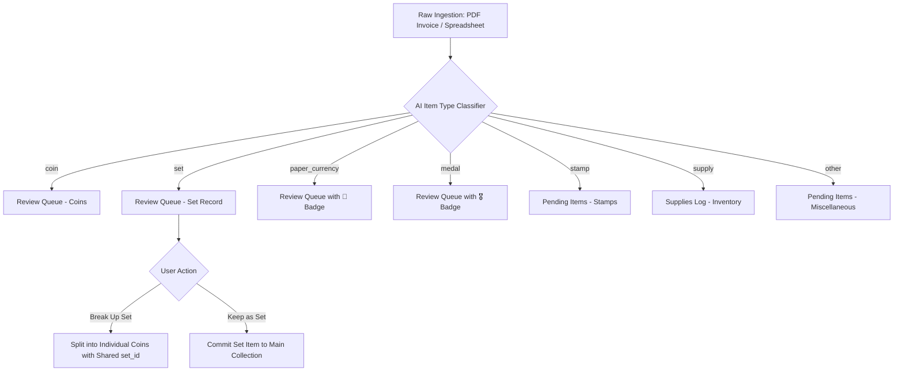
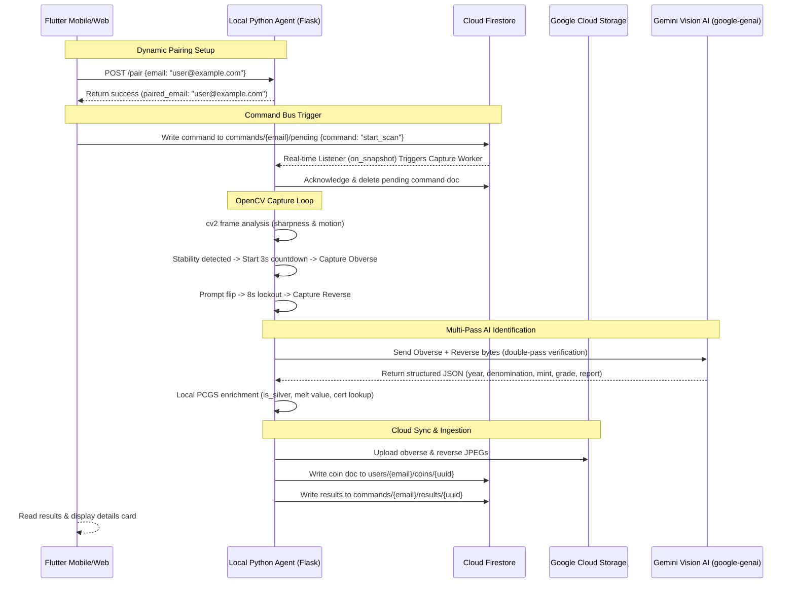

# Numista.AI — System Architecture Overview
> **Version:** June 2026 | **Author:** Numista Architecture Team | **Status:** Production-Ready Beta MVP

---

## Table of Contents
1. [System Overview](#1-system-overview)
2. [Module Map & GCP Resources](#2-module-map--gcp-resources)
3. [Layer-by-Layer Architecture](#3-layer-by-layer-architecture)
   - [3.1 Frontend — `numista_mobile` (Flutter)](#31-frontend--numista_mobile-flutter)
   - [3.2 Cloud Backend — `numista_backend` (FastAPI)](#32-cloud-backend--numista_backend-fastapi)
   - [3.3 Desktop Hardware Agent — `numista_hardware` (Python)](#33-desktop-hardware-agent--numista_hardware-python)
4. [Data Architecture](#4-data-architecture)
   - [4.1 Firestore Collections Structure](#41-firestore-collections-structure)
   - [4.2 Firestore Golden Schema & Ingestion Mapping](#42-firestore-golden-schema--ingestion-mapping)
5. [Data Flow Diagrams](#5-data-flow-diagrams)
   - [5.1 Universal Ingestion & Routing Flow](#51-universal-ingestion--routing-flow)
   - [5.2 Microscope Auto-Capture & Auto-Pairing Sequence](#52-microscope-auto-capture--auto-pairing-sequence)
6. [AI & Gemini Integration](#6-ai--gemini-integration)
   - [6.1 Models & SDK Configuration](#61-models--sdk-configuration)
   - [6.2 Robust JSON Extraction Recovery](#62-robust-json-extraction-recovery)
7. [Authentication & Security Model](#7-authentication--security-model)
8. [Deployment & CI/CD Pipelines](#8-deployment--cicd-pipelines)
9. [June 2026 Milestone Updates (Recent Changes)](#9-june-2026-milestone-updates-recent-changes)
10. [Known Limitations & Future Roadmap](#10-known-limitations--future-roadmap)

---

## 1. System Overview

Numista.AI is an advanced, cross-platform **coin collection and numismatic management application** powered by Google Gemini Vision AI. The system integrates mobile and web frontends with local specialized hardware (USB microscope scanning stations) and a FastAPI backend running on Google Cloud Platform (GCP).

Key user capabilities include:
- **Multi-Source Digitization**: Process collection records via bulk Excel/CSV ingestion, automated PCGS import, manual forms, or PDF checklist scanning.
- **Multimodal AI Identification**: Detect and evaluate coin characteristics using Gemini obverse/reverse visual analysis.
- **Microscope Scan Integration**: Perform automated desktop scans with stability detection, motion analysis, and local-to-cloud synchronization.
- **Financial & Portfolio Analytics**: Render live metal spot vs premium portfolio compositions, top coin series, and historic value progression.
- **Smart Estate Division**: Run asset partitioning allocations for heirs using a greedy LPT simulator with valuation offsets.

```
+-------------------------------------------------------------+
|                       numista_mobile                        |
|              Flutter Web / Android / iOS App                |
|           (User Portal, Portfolio Tracker, Analytics)        |
+--------------------------+----------------------------------+
                           | Firebase SDK (Auth, Firestore)
                           | REST API (Cloud Run Endpoints)
+--------------------------v----------------------------------+
|                    Google Cloud Platform                    |
|  +------------------+  +-------------------+  +----------+  |
|  |    Firestore     |  |    Cloud Run      |  |   GCS    |  |
|  |  (Database DB)   |  | (FastAPI Service) |  | (Uploads)|  |
|  +------------------+  +-------------------+  +----------+  |
|  +-------------------------------------------------------+  |
|  |             Gemini AI (google-genai v1.71.0)           |  |
|  +-------------------------------------------------------+  |
+-------------------------------------------------------------+
                           | Firestore Real-Time Listener
                           | Local pairing (POST /pair)
+--------------------------v----------------------------------+
|                      numista_hardware                       |
|         Windows Tray Desktop Agent (Python / Flask)         |
|        USB Microscope -> CV2 Loop -> GCS -> Firestore       |
+-------------------------------------------------------------+
```

---

## 2. Module Map & GCP Resources

| Module | Primary Language | Runtime | Deployment Method / Repository Location |
|--------|------------------|---------|-----------------------------------------|
| `numista_mobile` | Dart / Flutter | Web / Android / iOS | Firebase Web Hosting / Mobile App Stores |
| `numista_backend` | Python | Cloud Run | Containerized (`python:3.11-slim` base) |
| `numista_hardware` | Python | Windows | PyInstaller Windows Executable (`NumistaAgent.exe`) |

### Active Cloud Resources
- **GCP Project**: `studio-9101802118-8c9a8`
- **GCS Uploads Bucket**: `studio-9101802118-8c9a8-uploads`
- **Cloud Run Region**: `us-central1`
- **Production API URL**: `https://numista-backend-568985927038.us-central1.run.app`
- **Checklist/Estate Scan Service URL**: `https://scan-service-568985927038.us-central1.run.app`

---

## 3. Layer-by-Layer Architecture

### 3.1 Frontend — `numista_mobile` (Flutter)
The frontend is constructed in Flutter to achieve cross-platform native rendering across web browsers and mobile devices.

#### 3.1.1 Responsive Navigation & Screen Inventory
- `HomeDashboard` (`home_dashboard.dart`): Portfolio value trendlines, category breakdown, recently-added coin photo thumbnails, and interactive suggestion chips that route pre-configured prompt strings directly to the AI Chat screen.
- `MyCollectionScreen` (`my_collection_screen.dart`): Dynamic tabular view utilizing custom horizontal scrolling for comprehensive metadata rendering, accompanied by a slide-out coin details panel with metal value badges.
- `AddCoinsHub` (`add_coins_hub.dart`): Consolidated wizard supporting multiple ingestion modalities:
  - **Manual Form**: Reusable form validation for raw field entry.
  - **AI Photo ID Tab**: Dual-photo upload matching against Gemini's verification endpoint.
  - **PCGS Batch Import**: Certification number search and validation.
  - **Spreadsheet Upload**: Multi-column Excel/CSV ingestion parser.
- `WishlistScreen` (`wishlist_screen.dart`): Items marked as wanted, integrated with live eBay Partner Network affiliate cards.
- `AIChatScreen` (`ai_chat_screen.dart`): Persistent session history with dynamic title extraction and historic session loading.
- `SuppliesScreen` (`supplies_screen.dart`): Renders cataloged storage assets, folders, albums, and testing equipment reading from `supplies_log`.
- `HeirDivisionScreen` (`heir_division_screen.dart`): Configures beneficiary list and executes the LPT allocation simulation.

#### 3.1.2 Reusable Service Layer
- `epn_service.dart`: Live eBay affiliate link generation and campaign rotation.
- `wishlist_service.dart`: Live synchronization between collection status and wishlist completion rules.
- `pcgs_import_service.dart`: Resolves cert lookups via the Cloud Run bypass proxy to prevent CORS limitations.
- `hardware_service.dart`: Broadcasts start/stop instructions to local Flask routes and polls status flags.

---

### 3.2 Cloud Backend — `numista_backend` (FastAPI)
The central backend orchestrates model parameters, data normalizations, and external integrations.

#### 3.2.1 Core API Routes (`numista_backend/main.py`)
- **Ingestion & Validation**:
  - `POST /api/import_spreadsheet`: Parses Excel/CSV records, maps header variations, normalizes conditions, and resolves missing metadata.
  - `POST /api/process_invoice`: Ingests receipt PDFs, runs visual extraction, and categorizes line items.
- **AI Identification**:
  - `POST /api/identify_coin_photo`: Takes base64 obverse and reverse images, runs double-pass validation, crops coordinates, and populates Firestore.
  - `POST /api/deep_dive`: Generates comprehensive numismatic essays for target specimens.
- **System Synchronization**:
  - `POST /api/review/commit`: Moves validated records from the staging review queue into the primary collection.
  - `POST /api/review/break_up_set`: Deconstructs a coin set into individual coin records sharing a common `set_id`.
  - `POST /api/review/keep_set_as_is`: Commits a set as a single database item containing cataloged subsets.

---

### 3.3 Desktop Hardware Agent — `numista_hardware` (Python)
An always-on Windows utility interfacing local hardware with Firestore via a background thread listener and a local Flask API.

#### 3.3.1 Local Endpoints (`auto_capture.py` Flask Server)
- `POST /pair`: Dynamically registers the current desktop agent to the logged-in user email, ensuring secure operation in multi-user environments.
- `POST /start-scan`: Spawns the camera feed analysis loop.
- `GET /get-status`: Returns stability scores, motion flags, countdown values, and `paired_email`.
- `GET /frame`: Serves real-time MJPEG microscope frames to the Flutter UI.

#### 3.3.2 OpenCV CV2 Capture Loop
```
                [OpenCV Video Device Capture]
                              |
                              v
                  [Laplacian Sharpness Check]
                              |
                              v
                 [Gaussian Blur Motion Check]
                              |
              +---------------+---------------+
              |                               |
      [Stability Detected]            [Motion Detected]
              |                               |
              v                               v
       [Start 3s Hold]                 [Reset Countdown]
              |
              v
       [Obverse Saved]
              |
      [Flip Prompt Lockout]
              |
       [Reverse Saved]
```

---

## 4. Data Architecture

### 4.1 Firestore Collections Structure
Firestore maintains strict document scopes to achieve data safety across accounts:

```
├── users/
│   └── {user_email}/
│       ├── coins/                  <-- Main inventory collections
│       ├── wishlist/               <-- Wanted coins & checklists
│       ├── supplies_log/           <-- Folders, flips, albums
│       ├── pending_items/          <-- Non-coin artifacts (stamps, etc.)
│       └── ai_chat_sessions/       <-- Chat history collections
├── global_programs/                <-- US Mint program catalog definitions
├── coin_set_index/                 <-- Manifest metadata for coin sets
└── commands/
    └── {user_email}/
        ├── pending/                <-- Queue for microscope start triggers
        └── results/                <-- Output confirmation bus from agent
```

---

### 4.2 Firestore Golden Schema & Ingestion Mapping
To prevent schema degradation, all uploads and manual submissions are normalized before writing to Firestore.

#### Ingestion Header Normalization Rules
When spreadsheets or invoices are submitted, the backend converts colloquial column headers into their canonical equivalents:

| Ingested Column Header | Canonical Schema Field | Purpose |
|------------------------|------------------------|---------|
| `Price Paid`, `Cost/Price`, `Purchase Cost` | `Cost` | Financial acquisition track |
| `My Notes`, `Notes`, `Personal Notes I` | `Personal Notes` | Personal user comments |
| `Grading Cert #`, `Certification #` | `Certification Number` | Cert lookup ID |
| `Personal Ref #` | `Personal Reference #` | Inventory index marker |

#### Canonical Document Schema Spec
```json
{
  "Year": "1909",
  "Country": "United States",
  "Denomination": "Cent",
  "Mint Mark": "S",
  "Condition": "MS-64",
  "Program/Series": "Lincoln Cent",
  "Theme/Subject": "Lincoln Portrait / Wheat Ears",
  "Variety": "VDB",
  "Die Variety": "VDB",
  "Cost": "$1250.00",
  "Purchase Date": "2026-06-15",
  "Personal Notes": "Purchased at coin show",
  "PCGS Number": "2427",
  "Certification Number": "99999999",
  "Grading Service": "PCGS",
  "Holder Type": "PCGS Slab",
  "Is Silver": false,
  "Metal Content": "95% Copper, 5% Tin/Zinc",
  "Melt Value": "$0.03",
  "image_url_obverse": "https://storage.googleapis.com/.../obverse.jpg",
  "image_url_reverse": "https://storage.googleapis.com/.../reverse.jpg",
  "source": "manual | pcgs_api | spreadsheet | microscope",
  "verification_confidence": "HIGH",
  "created_at": "<Timestamp>"
}
```

---

## 5. Data Flow Diagrams

### 5.1 Universal Ingestion & Routing Flow


---

### 5.2 Microscope Auto-Capture & Auto-Pairing Sequence
The hardware agent connects to the frontend using a local Flask listener, avoiding secure sandbox restrictions:



---

## 6. AI & Gemini Integration

### 6.1 Models & SDK Configuration
To ensure compliance with SDK deprecation schedules, legacy `vertexai` and `google-generativeai` endpoints are decommissioned in production. The codebase uses `google-genai==1.71.0` in the backend.

```python
from google import genai
from google.genai import types

# Initializing unified Vertex AI client
client = genai.Client(
    vertexai=True,
    project="studio-9101802118-8c9a8",
    location="us-central1"
)
```

- **Checklist Scan & Ingestion**: `gemini-3-flash-preview` is used to run layout recognition and checkbox classification on high-resolution checklist images. Input program data is chunked dynamically to minimize token sizes.
- **Double-Pass Identification**: Obverse and reverse photos are evaluated in parallel. The results are passed to a validation prompt to ensure year, mint mark, and variety align with reference libraries.

---

### 6.2 Robust JSON Extraction Recovery
FastAPI implements an automated JSON truncation recovery wrapper. When responses hit token limits, it resolves trailing brackets, ensuring partial datasets are parsed instead of returning errors:

```python
def recover_truncated_json(raw_response: str) -> dict:
    """Finds the last complete JSON closure, injects brackets, and loads dictionary."""
    try:
        return json.loads(raw_response)
    except json.JSONDecodeError:
        last_brace = raw_response.rfind("}")
        if last_brace != -1:
            try:
                return json.loads(raw_response[:last_brace+1])
            except Exception:
                pass
        raise
```

---

## 7. Authentication & Security Model

- **Security Boundary**: Database access is restricted per-user via Firebase Security Rules on `users/{email}/coins`. The rules enforce that `request.auth.token.email == email` for all read and write queries.
- **Token Shielding**: External API secrets (such as the platform-wide PCGS Bearer Token) are stored securely under `config/pcgs` in Firestore, accessible only by admin roles. Users can set their custom token under `users/{email}.pcgsToken` as a secondary fallback.
- **Workload Identity Federation (WIF)**: Production servers utilize WIF for resource credentials, avoiding static JSON service account keys in the repository.

---

## 8. Deployment & CI/CD Pipelines

### Cloud Run Services Spec
Both services are hosted on GCP Cloud Run with automated scalability parameters:

1. **`numista-backend`** (Primary REST API):
   - **RAM**: 2 GiB
   - **Concurrency**: 20 requests per instance
   - **Instance Limits**: Min 1, Max 10 (guarantees zero cold-start latency)
   - **Base Image**: `python:3.11-slim`

2. **`numista-scan-service`** (Checklist & PDF Generator):
   - **RAM**: 1 GiB
   - **Instance Limits**: Min 0, Max 5

### Continuous Integration (GitHub Actions)
The workflow file `.github/workflows/deploy.yml` triggers on pushes to the `main` branch:
- **Backend Job**: Triggers a container build via `gcloud builds submit` and deploys it to Cloud Run.
- **Frontend Job**: Builds the Flutter web artifact (`flutter build web`) and deploys to Firebase Hosting.
- **Windows Build Job**: Packages `auto_capture.py` into a portable `.exe` using PyInstaller.

---

## 9. June 2026 Milestone Updates (Recent Changes)

Recent development sprints have successfully resolved several MVP issues, stabilizing the platform:

> [!NOTE]
> All changes have been deployed to production and verified with E2E Playwright test suites.

- **Unified Ingestion Normalization**: Spreadsheet parsing rules were hardened. Any uploaded spreadsheet containing colloquial headers (e.g. `Price Paid`, `Notes`) is automatically mapped to the Golden Schema, resolving database sync discrepancies.
- **Presidential $1 Coin Name Standardization**: Ingested coin names are normalized against the official US Mint Presidential nomenclature (e.g. "Grant" -> "Ulysses S. Grant"). Existing records were backfilled.
- **Heir Division Engine**: Implemented a greedy LPT simulator allowing collectors to allocate coin lots to heirs fairly. Includes real-time cash balance offsets and PDF summary exporting.
- **Microscope Agent Auto-Pairing**: Added `/pair` to the desktop agent, allowing the Flutter interface to bind the local hardware station to user accounts dynamically.
- **Installer Syntax Corrections**: Fixed a codec escape error in the Windows PyInstaller script, resolving setup compilation failures on modern interpreters.
- **Interactive Suggestion Chips**: Tappable suggestion chips were added to the dashboard, allowing users to pre-fill AI chat queries instantly.

---

## 10. Known Limitations & Future Roadmap

### Current Limitations
- **Multi-page PDF Processing**: Multi-page checklist documents are processed sequentially rather than in parallel, introducing latency on large files.
- **Mobile Store Distribution**: iOS and Android native deployment relies on ad-hoc builds due to missing developer account configurations.

### 2026 Development Roadmap
- [ ] Implement multi-threaded parallel page scanning.
- [ ] Add real-time Firebase Chat session management database triggers.
- [ ] Integrate live push alerts when items in the wishlist appear on eBay.
- [ ] Create a human-in-the-loop validation UI, letting users correct AI misclassifications.
- [ ] Package mobile application versions for the Apple App Store and Google Play Store.
