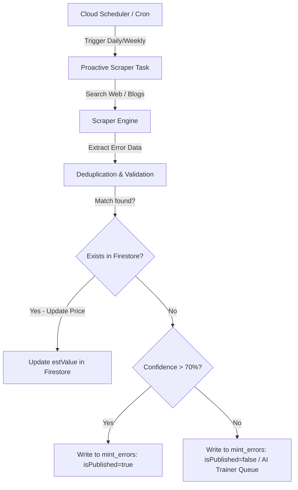

# Proactive Web-Scraping Agent Plan

This plan details the addition of a proactive cron-based background agent in the backend that periodically scrapes coin error blogs and databases to automatically update the Firestore `mint_errors` collection with new listings, auction prices, and descriptions.

## 1. Objectives

* **Automate Data Currency**: Run a scheduled task (cron job) to search and discover newly documented coin errors and price shifts.
* **Intelligent Deduplication**: Compare scraped errors against the existing Firestore `mint_errors` collection (using year, denomination, and error type) before inserting.
* **Low Confidence Safety Gate**: If a newly discovered error is found but has a low confidence or questionable source, send it to the **AI Trainer Board** rather than publishing directly.

---

## 2. Technical Architecture

---

## 3. Implementation Plan

### Step 1: Create Scraper Task File (`cron_scrape_errors.py`)
Add a new script under `numista_backend/cron_scrape_errors.py` that:
1. Performs targeted searches on sites like `coin-identifier.com/blog`, `error-ref.com`, and numismatic news sites.
2. Extracts coin details (name, year, denomination, estimated auction value, description).
3. Uses a lightweight LLM parsing pass (`gemini-3.5-flash`) to structure the HTML/markdown text into the clean `MintError` JSON schema.

### Step 2: Implement Deduplication & Confidence Scoring
* **Deduplication**: Match using a combination of `denomination`, `year`, and canonical ID slugs (e.g. `1999-nj-quarter-die-gouge`).
* **Confidence Rating**: The parsing LLM evaluates the source trustworthiness and clarity of the error description, outputting a `confidenceScore` (0.0 to 1.0).
  * If `confidenceScore` >= 0.70: Seeded directly as `isPublished = true`.
  * If `confidenceScore` < 0.70: Saved as `isPublished = false` for manual review.

### Step 3: Register the Cron/Scheduler Job
* Set up a recurring background schedule using Google Cloud Scheduler to trigger the endpoint `/api/cron/scrape-errors` on your Cloud Run instance weekly.

---

## 4. Verification Plan

* Run manual test triggers: `python cron_scrape_errors.py --dry-run` to verify it successfully fetches new data and outputs valid update/insert payloads without writing to production.
