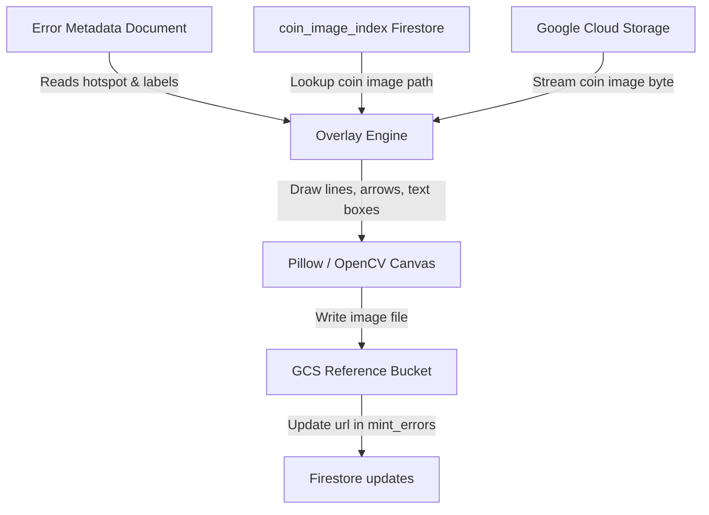

# Vector-Overlay Engine Plan

This plan details the implementation of an automated backend service to generate vector-overlay visual illustrations for mint errors using existing GCS reference images.

## 1. Objectives

* **Automate Image Generation**: Programmatically construct illustrated diagrams for the 150+ error types.
* **Leverage Existing Assets**: Use the thousands of high-quality coin images stored in GCS (`us_mint_coin_images` and `numista-reference-library`) via Firestore's `coin_image_index` collection.
* **Vector Annotation Layer**: Overlay pointer arrows, highlight regions (hotspots), and text boxes with exact error information using a Python drawing service.

---

## 2. Technical Architecture

### Component Breakdown

1. **Firestore Query Resolver**: Reads the `mint_errors` collection to locate metadata for errors (like denominations, years, and the `images.hotspot` coordinates).
2. **Reference Image Picker**: Looks up the matching coin design in the `coin_image_index` collection. For instance, for `1999 New Jersey quarter`, it finds:
   * `gs://us_mint_coin_images/Numista_Attributed_Coins (1)/1999_new-jersey_50-state-quarters_reverse.jpg`
3. **Pillow Canvas Renderer**: Downloads the coin image, runs a drawing pass to overlay:
   * **Target Ring**: A highlighted bounding circle around the error location.
   * **Callout Arrow**: A line with a clean chevron head starting outside the coin.
   * **Glossy Label Box**: A rounded-rectangle box with the error designation/description.
4. **Writer Service**: Uploads the finished illustration to the public assets directory `gs://numista-uploads-studio-9101802118-8c9a8/error_library_illustrations/` and links it back to the `mint_errors.images[].url` field.

---

## 3. Implementation Steps

### Step 1: Add Canvas Generation Script (`generate_error_illustrations.py`)
Create a backend generator in `numista_backend` using `Pillow` to draw:
* Clean fonts (e.g. `Roboto-Bold.ttf` or default sans-serif).
* Translucent dark backgrounds for text overlays.
* Pointer lines pointing from coordinates `(x1, y1)` to `(x2, y2)`.

### Step 2: Implement Hotspot Scaling
The hotspots are stored in the database as percentages (`"x": 0.50, "y": 0.60, "radius": 0.08`). The script will multiply these percentages by the loaded image's pixel dimensions to draw annotations that scale perfectly regardless of whether the source photo is 500x500 or 2000x2000 pixels.

### Step 3: Run the Script for 1999 NJ Quarter
Verify on the two newly seeded errors:
* Double Struck / Off-Center
* Die Gouge / Extra Tree

---

## 4. Verification Plan

* Run script locally via `.venv\Scripts\python.exe generate_error_illustrations.py --dry-run` to output locally into `numista_backend/assets/temp_illustrations/` for review.
* Validate generated images look clean, sharp, and point to the correct coin sections.
